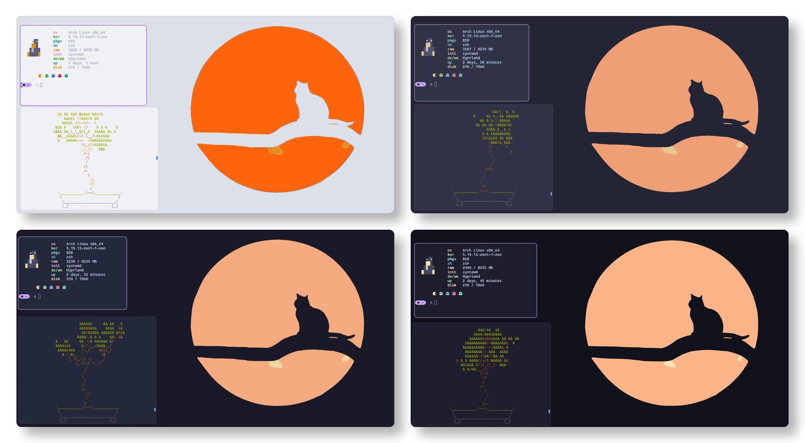
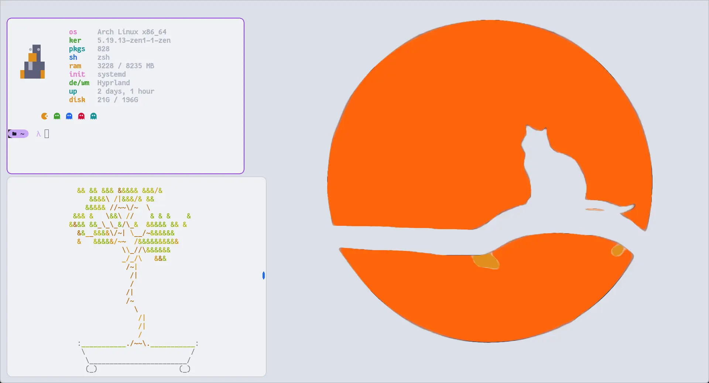
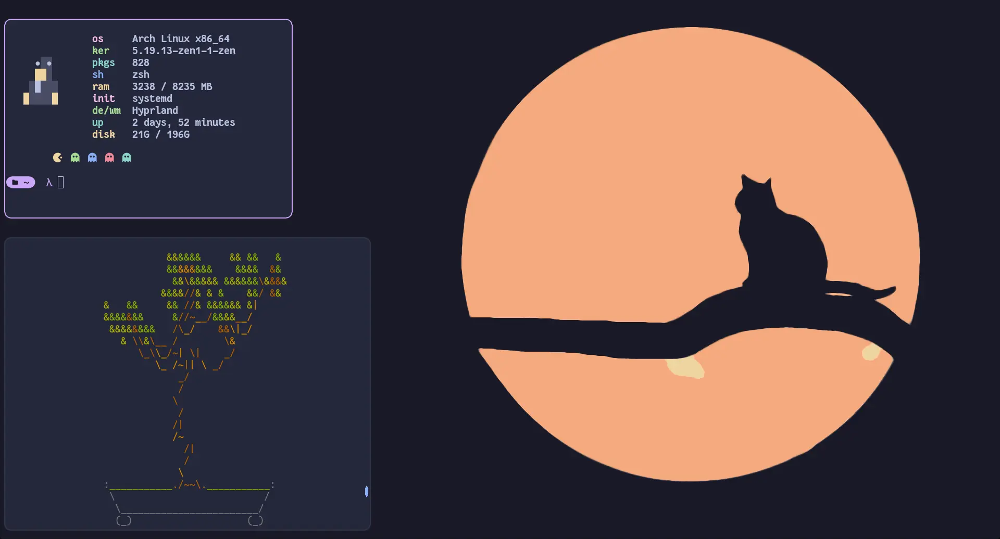
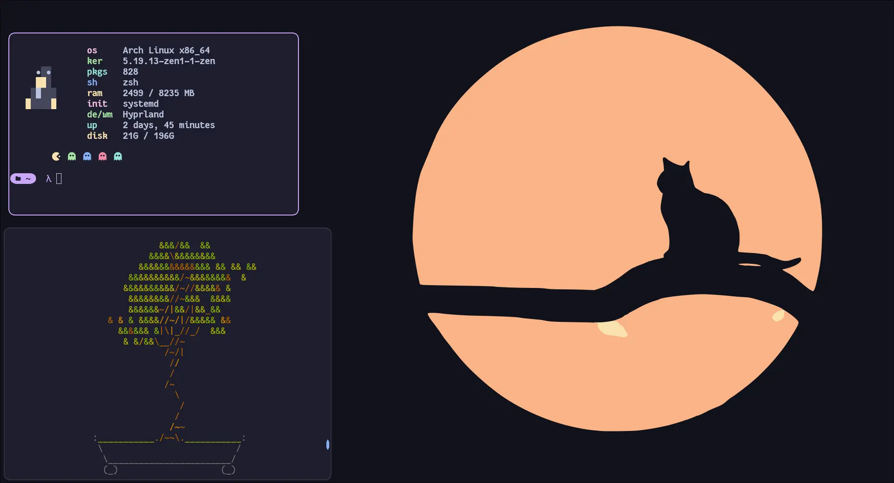

<h3 align="center">
	<br/>
	
	Catppuccin for <a href="https://github.com/hyprwm/hyprland">Hyprland</a>
	
</h3>

<p align="center">
	<a href="https://github.com/catppuccin/hyprland/stargazers"></a>
	<a href="https://github.com/catppuccin/hyprland/issues"></a>
	<a href="https://github.com/catppuccin/hyprland/contributors"></a>
</p>

<p align="center">
  
</p>

## Previews

<details>
<summary>🌻 Latte</summary>

</details>
<details>
<summary>🪴 Frappé</summary>

</details>
<details>
<summary>🌺 Macchiato</summary>

</details>
<details>
<summary>🌿 Mocha</summary>

</details>

## Usage

> [!IMPORTANT]  
> Since Hyprland `0.55`, Hyprland configuration is done in Lua.
> For the legacy `.conf` format, please visit and follow the instructions on the [v1.3](https://github.com/catppuccin/hyprland/tree/v1.3) tag.

1. Download the theme for your desired flavour, e.g. `catppuccin-mocha.lua` (from the [release](https://github.com/catppuccin/hyprland/releases/latest) or from `themes/lua/` after cloning)
2. Copy it into your Hyprland config, e.g. `~/.config/hypr/themes/catppuccin-mocha.lua`
3. Load it from your `hyprland.lua`

```lua
local colors = require('themes.catppuccin-mocha')
```

4. Use colors

```lua
-- Non-alpha values are already in Hyprland's rgb(...) format.
local base = colors.base

-- Alpha values are hex without transparency; append the alpha, eg. `ee` and wrap in rgba(...).
local surface0_ee = rgba(colors.surface0Alpha .. 'ee')
```

## 🙋 FAQ

-	Q: **_"Hyprland doesn't work with the colors"_**\
	A: Make sure you are loading the correct theme file for your Hyprland version (`.lua` for >= 0.55) and referencing the values correctly (e.g. `colors.base`).

## 💝 Thanks to

- [rubyowo](https://github.com/rubyowo)

&nbsp;

<p align="center">
	
</p>

<p align="center">
	Copyright &copy; 2021-present <a href="https://github.com/catppuccin" target="_blank">Catppuccin Org</a>
</p>

<p align="center">
	<a href="https://github.com/catppuccin/catppuccin/blob/main/LICENSE"></a>
</p>
