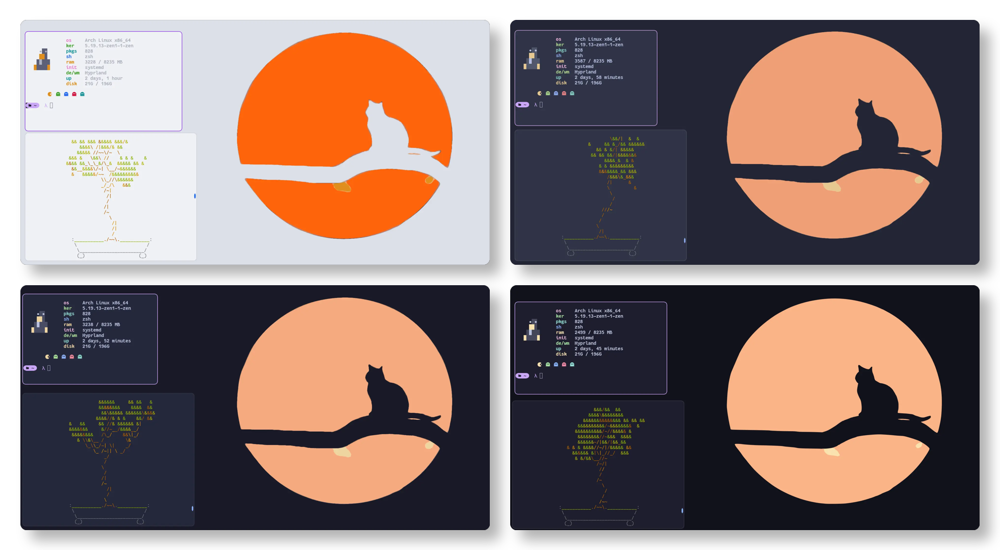
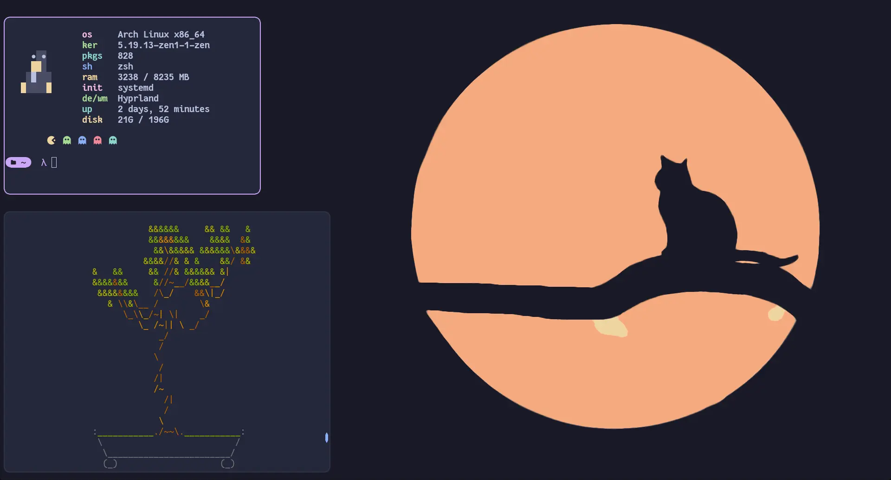

<h3 align="center">
	 
	
	Catppuccin for <a href="https://github.com/hyprwm/hyprland">Hyprland</a>
	
</h3>

	
	
	

  

## Previews

🌻 Latte

🪴 Frappé

🌺 Macchiato

🌿 Mocha

## Usage

1. Download the file with your desired flavour e.g. `mocha.conf` (to be found in the [release](https://github.com/catppuccin/hyprland/releases/latest) or after cloning the repository in `themes/`)
2. Copy it into your hyprland config e.g. `~/.config/hypr/`
3. Include the file at the top of your `hyprland.conf`
   - `source=~/.config/hypr/mocha.conf`
4. When using the non-alpha colors, use `$COLOR` e.g. `$base`
5. When using the alpha colors use something like `rgba($COLORAlpha<transparency>)` e.g. `rgba($surface0Alphaee)`

## 🙋 FAQ

-	Q: **_"Hyprland doesn't work with the colors"_**\
	A: Make sure you included the file in the right place and you are using `$COLOR`

## 💝 Thanks to

- [rubyowo](https://github.com/rubyowo)

&nbsp;

	

	Copyright &copy; 2021-present <a href="https://github.com/catppuccin" target="_blank">Catppuccin Org</a>

	

